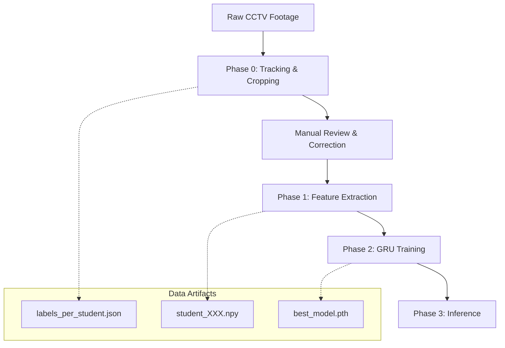

# System Architecture: Unityy Exam Cheating Detection

This document outlines the technical architecture of the **Unityy** system, a multi-phase deep learning pipeline designed to detect exam cheating behaviors from CCTV footage.

## 1. High-Level Overview

The system is structured as a sequential pipeline that transforms raw video frames into individual student behavior predictions.



---

## 2. Phase 0: Tracking & Label Assignment
**Script**: `tracker_bytetrack_v3.py`

This phase focuses on isolating individual students from the full-frame video and maintaining their identity across frames.

- **Ground Truth Detections**: Unlike standard tracking which relies on YOLO inference, this phase uses **manually annotated ground truth (GT) labels** (`.txt` files) to ensure 100% detection accuracy.
- **ByteTrack**: Uses **ByteTrack** with a Kalman filter to maintain identity even with slow camera movements and partial occlusions.
- **ID Consistency**: All students are tracked as a single `person` class. This prevents track fragmentation when a student's behavior state changes (e.g., from *not_cheating* to *cheating*).
- **Label Matching**: Uses **IoU (Intersection over Union)** matching to link tracked student boxes with their original ground truth class.
- **Manual Review (Critical)**: After the automated tracking, a manual review of the crops is performed to correct any `student_id` grouping errors, ensuring perfect data continuity.
- **Output**: 
    - Folders of cropped images per student.
    - `labels_per_student.json`: A per-frame ground truth mapping for each identity.

---

## 3. Phase 1: Feature Extraction
**Script**: `feature_extractor_v3.py`

This phase converts visual sequences into numerical feature vectors that represent physical behavior.

- **Pose Estimation**: Uses **YOLO11-pose** to detect 17 keypoints. We specifically focus on 5 head keypoints and 2 shoulder keypoints.
- **Geometric Modeling**:
    - **Yaw/Pitch/Roll Proxy**: Calculated geometrically based on the relative distances between eyes, ears, nose, and shoulders.
    - **Head-Body Relation**: Measures the vertical displacement of the head relative to the shoulders (detecting "bowing" or "looking down").
- **Temporal Dynamics**: Calculates the **velocity** ($\Delta x, \Delta y$) of head keypoints between consecutive frames.
- **Feature Vector (38-Dim)**:
    - `[0:21]` Raw Keypoints (x, y, confidence)
    - `[21:24]` Geometric Pose (Yaw, Pitch, Roll)
    - `[24:26]` Head-Body Relation (Relative Y, Size Ratio)
    - `[26:28]` Visibility Flags (Facing back, confidence)
    - `[28:38]` Temporal Velocity
- **Output**: `.npy` files for each student sequence.

---

## 4. Phase 2: Sequential Modeling (GRU)
**Script**: `model.py` & `train.py`

The core brain of the system that analyzes the temporal patterns extracted in Phase 1.

### Model Architecture (`CheatingGRU`)
1. **Input Normalization**: `LayerNorm` to stabilize training.
2. **GRU Backbone**: A 2-layer Gated Recurrent Unit (GRU) to process temporal sequences.
3. **Temporal Attention**: An additive attention mechanism that assigns higher weights to specific "guilty" frames (e.g., the moment a student turns their head).
4. **Classifier Head**: Fully connected layers with ReLU activation leading to a single binary logit.

### Training Strategy
- **Imbalance Handling**: 
    - `BCEWithLogitsLoss` with `pos_weight` to penalize misses on the minority (cheating) class.
    - `WeightedRandomSampler` to ensure balanced batches during training.
- **Optimization**: Adam optimizer with `ReduceLROnPlateau` scheduler and Early Stopping.
- **Data Augmentation**: `TemporalAugmentor` applies random noise, temporal flipping (reversing the sequence), masking, and jittering to improve generalization.

---

## 5. Data Flow Summary

| Phase | Input | Process | Output |
| :--- | :--- | :--- | :--- |
| **0** | Full Video Frames | ByteTrack + IoU Match | Student Crops + JSON Labels |
| **1** | Student Crops | YOLO Pose + Geometry | 38-dim Feature Vectors (`.npy`) |
| **2** | Feature Vectors | GRU + Attention | Trained Model (`.pth`) |
| **3** | New Video | Pipeline 0 -> 1 -> 2 | Cheating Probability [0.0 - 1.0] |

---

## 6. Directory Structure
```text
.
├── dataset/             # Raw dataset (images & labels)
├── crop/                # Phase 0 Output (crops & per-student labels)
├── features/            # Phase 1 Output (extracted numerical features)
├── output/              # Phase 2 Output (trained models & training plots)
├── model.py             # GRU Architecture definition
├── dataset.py           # PyTorch Dataset implementation
└── train.py             # Training pipeline and CLI
```
